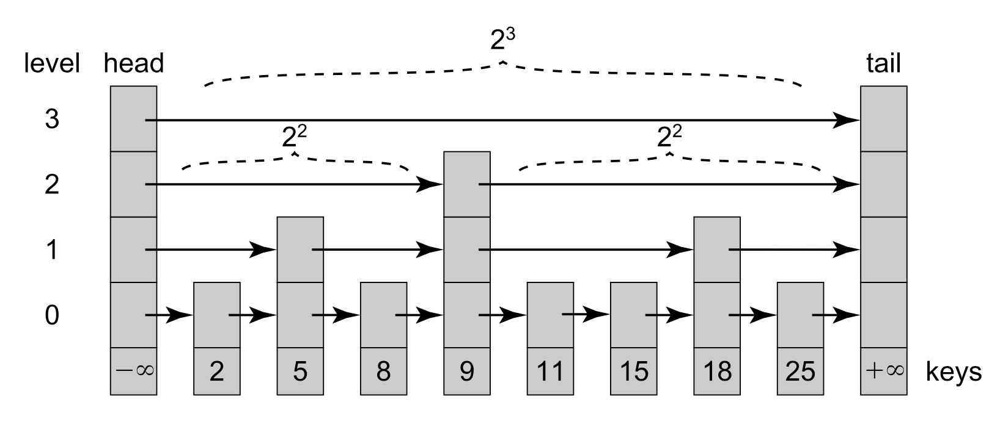
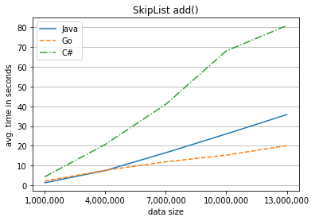
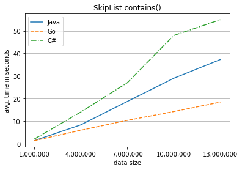
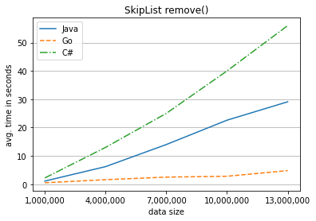
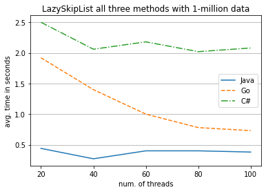
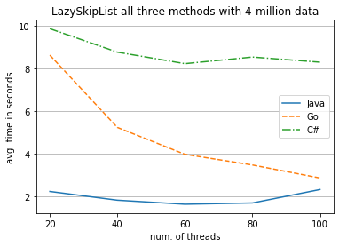
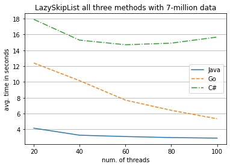
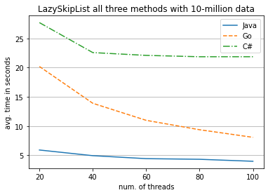
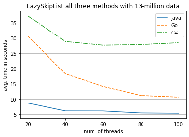

# Concurrent SkipList and Balanced Search
> This project is about SkipList and balanced search. The content includes some logorithmic notations about the data structure and algorithms, as well as implementations in Java, Golang, and C#.

> Last updated on April 6, 2021 by Ruizhe Zhang

# Skip Lists and Balanced Search

## SkipList

`SkipList` is a randomized random-access list. Like some of the other balanced-tree-like sequential search structures (e.g., Red-black Trees, AVL Trees), SkipLists provide logarithmic-time search. Those other structures require periodic rebalancing (i.e., restructuring the tree every time there is a change). However, for concurrent situations, rebalancing may cause problems such as bottlenecks and contention.

`SkipList` provides expected logarithmic-time (`O(logn)`) balanced search without rebalancing.

For simplicity, we treat the skiplist as a set, meaning that keys are unique. A `SkipList` is a collection of sorted linked lists, essentially equivalent to a balanced search tree.

For concurrent design, a commonly used one is a lock-based algorithm named `LazySkipList`, which is invented and published by Maurice Herlihy, Yossi Lev, Victor Luchangco, and Nir Shavit in 2006.

In this project, we will see both the sequential and the concurrent versions of SkipList in an algorithmic notation and the actual implementations using three programming languages, `Java`, `Go` and `C#` respectively. The performances will also be compared.

Nodes in a SkipList are ordered by key. Each node is linked into a subset of the lists. Each list has a level, ranging from 0 to a maximum. The bottom-level list contains all the nodes, and each higher-level list is a sublist of the lower-level lists.

Also, The `SkipList` is a probabilistic (randomized) data structure. Each node is assigned a random height, up to the maximum. The number of nodes at any height `decreases exponentially` with that height, which is the key to the logarithmic searching time.

Probabilistically, the higher-level lists are shortcuts of the lower-level lists, each link between two nodes at level i skips over about 2i nodes in the lowest-level list:



So actually, we can only say that `SkipList` gives an expected search time of `O(logn)` because of the probability. The worst-case complexity could still be `O(n)` if the shortcuts don't skip many nodes, which would be the same as making a linear search on the original (bottom) layer list.

## Sequential Algorithm

The main invariant of the SkipList class is to keep the `skiplist property`[1]: Higher-level lists are always contained in lower-level lists. I.e., the list at each layer is a sublist of the lists at lower layers (except for the bottom layer, which has no lower layers).

We also define each layer of a skiplist as a set and contains nodes with ascending ordered keys. The Node class is a sub-component class within the SkipList.

SkipList class:

```
algorithm
class SkipList
    const max_level: integer
    const probability: double  
    const head := Node(MIN_INTEGER)
    const tail := Node(MAX_INTEGER)

    {max_level ≥ 1 ∧ 0 ≤ probability ≤ 1 ∧ ∀ i ∈ 1 .. max_level, n ∈ head.next(i) · n ∈ head.next(i - 1)}
    initialization()
        var i := 0
        for i = 0 to max_level - 1 do
            head.next(i) := tail 

    method random_level() → (integer)
        var l := 1
        for i = 0 to max_level - 1 do
            var rand := rand(0,1) // random float number between 0 and 1
            if rand ≤ probability then l := l + 1
            else return l
        return l
        {l ≤ max_level}

    method find(x: integer, preds, succs: array of references to Nodes) → (layer_found: integer)
        var key := x
        var layer_found := -1
        var pred := head
        for level = max_level to 0 do
            var curr := pred.next(level)
            while key > curr.key
                pred := curr
                curr := pred.next(level)
            if layer_found = -1 and key = curr.key then layer_found := level
            preds(level) := pred
            succs(level) := curr
        {-1 ≤ layer_found ≤ max_level}

    method add(x : integer) → (succeed: boolean)
        var preds : array 0 .. max_level of references to Nodes
        var succs : array 0 .. max_level of references to Nodes
        var layer_found := find(x, preds, succs)
        if layer_found ≠ -1 then succeed := false
        else
            var top_level := random_level()
            var new_node := Node(x, top_level)
            for i = 0 to top_level do
                new_node.next(level) := succs(level)
                preds(level).next(level) := new_node
            succeed := true

    method remove(x : integer) → (succeed: boolean)
        var victim : Node
        victim := null
        var top_level := -1
        var preds : array 0 .. max_level of references to Nodes
        var succs : array 0 .. max_level of references to Nodes
        var layer_found := find(x, preds, succs)
        if layer_found ≠ -1 then
            victim := succs(layer_found)
            top_level := victim.top_level
            for level = top_level to 0 do
                preds(level).next(level) := victim.next(level)
            succeed := true
        else succeed := false

    method contains(x : integer) → (found: boolean)
        var preds : array 0 .. max_level of references to Nodes
        var succs : array 0 .. max_level of references to Nodes
        var layer_found := find(x, preds, succs)
        found := (layer_found = -1)
```

Node class:

```
algorithm
class Node
var item: item
var key, top_level: integer
var next: array 0 .. max_level of references to Nodes

{∀ Node n, for 0 ≤ i ≤ n.top_layer, n.nexts(i) ≠ tail => n.key < n->nexts(i).key}
initialization(k: integer)
    key := k
    top_level := max_level

initialization(x: T, height: integer)
    {height ≤ max_level}
    item := x
    key := x
    top_level := height
```


### SkipList in Java

```java
import java.util.Random;

public final class SkipList {
    static final int MAX_LEVEL = 32;
    static final double Prob = 0.5;
    final Node head = new Node(Integer.MIN_VALUE); // set head to the smallest integer
    final Node tail = new Node(Integer.MAX_VALUE); // set tail to the biggest integer
    
    public SkipList() {
        for (int i = 0; i < head.next.length; i++) {
            head.next[i] = tail; // initialize all layers with only the head and the tail
        }
    }
    
    // generate a random level number that provides a balancing property
    // Top levels are chosen so that the expected number of nodes in each level’s list decreases exponentially
    private int randomLevel() {
        int level = 1;
        for (int i = 0; i < MAX_LEVEL; i++) {
            Random rand = new Random();
            float f = rand.nextFloat();
            if (f <= Prob) {
                level++;
            }
            else {
                return level;
            }
        }
        return level;
    }

    int find(int x, Node[] preds, Node[] succs) {
        int key = x;
        // will return -1 if not found in any layer
        int layerFound = -1;
        // start traversal from the head sentinel
        Node pred = head;
        for (int level = MAX_LEVEL; level >= 0; level--) {
            Node curr = pred.next[level];
            // compare key with curr.key until hit tail, i.e. a MAX_VALUE
            while (key > curr.key) {
                pred = curr;
                curr = pred.next[level];
            }
            if (layerFound == -1 && key == curr.key) {
                layerFound = level;
            }
            preds[level] = pred;
            succs[level] = curr;
        }
        return layerFound;
    }
    
    boolean add(int x) {
        // initialize pred and succ arrays
        Node[] preds = (Node[]) new Node[MAX_LEVEL + 1];
        Node[] succs = (Node[]) new Node[MAX_LEVEL + 1];
        int layerFound = find(x, preds, succs);
        // Case 1 - element found in the list, unsuccessful add
        if (layerFound != -1) {
            return false;
        }
        // Case 2 - not found in the list, create a new node with a random top-level
        int topLevel = randomLevel();
        Node newNode = new Node(x, topLevel);
        for (int level = 0; level <= topLevel; level++) {
            newNode.next[level] = succs[level];
            preds[level].next[level] = newNode;
        }
        // successful add
        return true;
    }
    
    boolean remove(int x) {
        Node victim = null;
        int topLevel = -1;
        // initialize pred and succ arrays
        Node[] preds = (Node[]) new Node[MAX_LEVEL + 1];
        Node[] succs = (Node[]) new Node[MAX_LEVEL + 1];
        // use find to check if node is in list
        int layerFound = find(x, preds, succs);
        if (layerFound != -1) {
            victim = succs[layerFound];
            topLevel = victim.topLevel;
            // remove links to victim, top-down
            for (int level = topLevel; level >= 0; level--) {
                preds[level].next[level] = victim.next[level];
            }
            // successful delete
            return true;
        } 
        // did not find a matching node, unsuccessful delete
        return false;
    }
    
    boolean contains(int x) {
        Node[] preds = (Node[]) new Node[MAX_LEVEL + 1];
        Node[] succs = (Node[]) new Node[MAX_LEVEL + 1];
        int layerFound = find(x, preds, succs);
        return layerFound != -1;
    }
    
    private static final class Node {
        final int item;
        final int key;
        final Node[] next;
        private int topLevel;
        // sentinel node constructor (head and tail)
        public Node(int key) { 
            this.item = key;
            this.key = key;
            this.next = new Node[MAX_LEVEL + 1];
            this.topLevel = MAX_LEVEL;
        }
        
        public Node(int x, int height) {
            this.item = x;
            this.key = x;
            this.next = new Node[height + 1];
            this.topLevel = height;
        }
    }
    
    public static void main(String [] args) {
        SkipList list = new SkipList();
        int n = 2000000;
        int[] a = new int[n];
        Random rand = new Random();
        long start;
        long end;
        for (int i = 0; i < n; i++) {
            a[i] = rand.nextInt(n);
        }
        
        // test add
        start = System.currentTimeMillis();
        for (int i = 0; i < n; i++) {
            list.add(a[i]);
        }      
        end = System.currentTimeMillis();
        System.out.println("Java sequential add() " + n + " nodes, time: " + (end - start) / 1000.0 + " s");

        // test contains
        start = System.currentTimeMillis();
        for (int i = 0; i < n; i++) {
            list.contains(a[i]);
        }      
        end = System.currentTimeMillis();
        System.out.println("Java sequential contains() " + n + " nodes, time: " + (end - start) / 1000.0 + " s");
        
        // test remove
        start = System.currentTimeMillis();
        for (int i = 0; i < n; i++) {
            list.remove(a[i]);
        }      
        end = System.currentTimeMillis();
        System.out.println("Java sequential remove() " + n + " nodes, time: " + (end - start) / 1000.0 + " s");       
    }
}
```

#### These are some example testing results, for complete results please see the performance table.

Java sequential add() 3000000 nodes, time: 5.956 s
Java sequential contains() 3000000 nodes, time: 6.257 s
Java sequential remove() 3000000 nodes, time: 4.843 s


### SkipList in Go

```go
package main
import "math/rand"
import "fmt"
import "time"

const MAX_LEVEL int = 32
const Prob float32 = 0.5

func randomLevel() int {
    level := 1
    rand.Seed(time.Now().UnixNano())
    for i := 0; i < MAX_LEVEL; i++ {
        if rand.Float32() <= Prob {
            level++
        } else {
            return level
        }
    }
    return level
}

type SkipList struct {
    head  *Node
    tail *Node
    level int
}

type Node struct {
    key int
    item int
    top_level int
    next []*Node
}

func newNode(key, item, height int) *Node {
    new_node := Node{
        key: key, 
        item: item,
        top_level: height,
        next: make([]*Node, height)}
    return &new_node
}

func newSkipList() SkipList {
    newList := SkipList{
        head: newNode(-999, -999, MAX_LEVEL), 
        tail: newNode(9999999999, 9999999999, MAX_LEVEL),
        level: 1}
    
    for i := 0; i < MAX_LEVEL; i++ {
        newList.head.next[i] = newList.tail
    }
    
    return newList
}

func (this *SkipList) find(key int) (int, []*Node, []*Node) {
    layer_found := -1
    preds := make([]*Node, MAX_LEVEL + 1)
    succs := make([]*Node, MAX_LEVEL + 1)
    pred := this.head
    
    for l := MAX_LEVEL - 1; l >= 0; l-- {
        curr := pred.next[l]
        for key > curr.key {
            pred = curr
            curr = pred.next[l]
        }
        if layer_found == -1 && key == curr.key {
            layer_found = l
        }
        preds[l] = pred
        succs[l] = curr
    }
    return layer_found, preds, succs
}

func (this *SkipList) contains(x int) bool {
    layer_found := -1
    layer_found, _, _ = this.find(x)
    return layer_found != -1
}

func (this *SkipList) add(x int) bool {
    preds := make([]*Node, MAX_LEVEL)
    succs := make([]*Node, MAX_LEVEL)
    layer_found := -1
    layer_found, preds, succs = this.find(x)
    
    if layer_found != -1 {
        return false
    }
    top_level := randomLevel()
    new_node := newNode(x, x, top_level)
    for i := 0; i <= top_level - 1; i++ {
        new_node.next[i] = succs[i]
        preds[i].next[i] = new_node
    }
    return true
}

func (this *SkipList) remove(x int) bool {
    top_level := -1
    preds := make([]*Node, MAX_LEVEL)
    succs := make([]*Node, MAX_LEVEL)
    layer_found := -1
    layer_found, preds, succs = this.find(x)
    if layer_found != -1 {
        victim := succs[layer_found]
        top_level = victim.top_level
        for i := top_level - 1; i >=0; i-- {
            preds[i].next[i] = victim.next[i]
        }
        return true
    }
    return false
}

func main() {
    list := newSkipList()
    n := 1000000
    nodes := make([]int, n)
    
    rand.Seed(time.Now().UnixNano())
    for i := 0; i < n; i++ {
        nodes[i] = rand.Intn(100000)
    }
    start := time.Now()
    for i := 0; i < n; i++ {
        list.add(nodes[i])
    }
    elapsed := time.Since(start)
    fmt.Println("Go sequential add()", n, "nodes, time:",  elapsed.Seconds(), "s")
    
    start = time.Now()
    for i := 0; i < n; i++ {
        list.contains(nodes[i])
    }
    elapsed = time.Since(start)
    fmt.Println("Go sequential contains()", n, "nodes, time:",  elapsed.Seconds(), "s")
    
    start = time.Now()
    for i := 0; i < n; i++ {
        list.remove(nodes[i])
    }
    elapsed = time.Since(start)
    fmt.Println("Go sequential remove()", n, "nodes, time:",  elapsed.Seconds(), "s")
}
```

#### These are some example testing results, for complete results please see the performance table.

Go sequential add() 5000000 nodes, time: 3.553665999 s
Go sequential contains() 5000000 nodes, time: 3.20471578 s
Go sequential remove() 5000000 nodes, time: 1.702062709 s


### SkipList in C#

```c#
using System;
using System.Threading;
using System.Threading.Tasks;

namespace skiplist
{
    class SkipListProgram
    {
        static void Main()
        {
            var list = new SkipList();
            int n = 1000000;
            int[] a = new int[n];
            
            Random rand = new Random();
            var watch = new System.Diagnostics.Stopwatch();

            for (int i = 0; i < n; i++) {
                a[i] = rand.Next(1, n);
            }
        
            // test add
            watch.Start();
            for (int i = 0; i < n; i++) {
                list.Add(a[i]);
            }      
            watch.Stop();
            Console.WriteLine("Add():"+ n +" nodes, time: "+ watch.ElapsedMilliseconds / 1000 + " s");
            
            watch.Reset();
            // test contains
            watch.Start();
            for (int i = 0; i < n; i++) {
                list.Contains(a[i]);
            }      
            watch.Stop();
            Console.WriteLine("Contains():"+ n +" nodes, time: "+ watch.ElapsedMilliseconds / 1000 + " s");
            
            watch.Reset();
            // test remove
            watch.Start();
            for (int i = 0; i < n; i++) {
                list.Remove(a[i]);
            }      
            watch.Stop();
            Console.WriteLine("Remove():"+ n +" nodes, time: "+ watch.ElapsedMilliseconds / 1000 + " s");
        }
    }

    public class SkipList {
        const int MAX_LEVEL = 32;
        const double Prob = 0.5;
        Node head = new Node(int.MinValue);
        Node tail = new Node(int.MaxValue);
        
        public SkipList() {
            for (int i = 0; i < head.next.Length; i++) {
                head.next[i] = tail; // initialize all layers with only the head and the tail
            }
        }
        
        // generate a random level number that provides a balancing property
        // Top levels are chosen so that the expected number of nodes in each level’s list decreases exponentially
        private int randomLevel() {
            Random random = new Random();
            int level = 1;
            for (int i = 0; i < MAX_LEVEL; i++) {
                double f = random.NextDouble();
                if (f <= Prob) {
                    level++;
                }
                else {
                    return level;
                }
            }
            return level;
        }

        int find(int x, Node[] preds, Node[] succs) {
            int key = x;
            // will return -1 if not found in any layer
            int layerFound = -1;
            // start traversal from the head sentinel
            Node pred = head;
            for (int level = MAX_LEVEL; level >= 0; level--) {
                Node curr = pred.next[level];
                // compare key with curr.key until hit tail, i.e. a MAX_VALUE
                while (key > curr.key) {
                    pred = curr; 
                    curr = pred.next[level];
                }
                if (layerFound == -1 && key == curr.key) {
                    layerFound = level;
                }
                preds[level] = pred;
                succs[level] = curr;
            }
            return layerFound;
        }

        public bool Add(int x) {
            // initialize pred and succ arrays
            Node[] preds = new Node[MAX_LEVEL + 1];
            Node[] succs = new Node[MAX_LEVEL + 1];
            int layerFound = find(x, preds, succs);
            // Case 1 - element found in the list
            if (layerFound != -1) {
                return false;
            }

            // Case 2 - not found in the list
            int topLevel = randomLevel(); // must decrease exponentially
            Node newNode = new Node(x, topLevel);
            for (int level = 0; level <= topLevel; level++) {
                newNode.next[level] = succs[level];
                preds[level].next[level] = newNode;
            } 
            // successful add
            return true;
        }

        public bool Remove(int x) {
            Node victim = null;  
            int topLevel = -1;
            // initialize pred and succ arrays
            Node[] preds = new Node[MAX_LEVEL + 1];
            Node[] succs = new Node[MAX_LEVEL + 1];
            int layerFound = find(x, preds, succs);
            if (layerFound != -1) {
                victim = succs[layerFound];
                topLevel = victim.topLevel;   
                // physically remove link to victim, top-down
                for (int level = topLevel; level >= 0; level--) {
                    preds[level].next[level] = victim.next[level];
                }
                // successful delete
                return true;
            }
            // did not find a matching node, unsuccessful delete
            return false;
        }

        public bool Contains(int x) {
            Node[] preds = new Node[MAX_LEVEL + 1];
            Node[] succs = new Node[MAX_LEVEL + 1];
            int layerFound = find(x, preds, succs);
            return layerFound != -1;
        }

        private class Node {
            public int item;
            public int key;
            public Node[] next;
            public int topLevel;
            
            // sentinel node constructor (head and tail)
            public Node(int key) { 
                this.item = key;
                this.key = key;
                this.next = new Node[MAX_LEVEL + 1];
                this.topLevel = MAX_LEVEL;
            }
            
            public Node(int x, int height) {
                this.item = x;
                this.key = x;
                this.next = new Node[height + 1];
                this.topLevel = height;
            }
        }
    }
}
```

#### These are some example testing results, for complete results please see the performance table.

Add():20000000 nodes, time: 155 s
Contains():20000000 nodes, time: 110 s
Remove():20000000 nodes, time: 118 s


## LazySkipList - a lock-based concurrent skiplist

The `LazySkipList` is invented by [2] in 2006. This lock-based concurrent SkipList design is based on two complementary techniques: `optimistic` and `lazy`.

`optimistic`: the traversal of the list does not acquire locks. While the list is being traversed, locks by other threads are ignored. Only when a method discovers the items it is seeking does it lock the item and its predecessors and then validates that the list is unchanged.

`lazy`: removing an item involves logically deleting it by marking it before it is physically removed (unlinked) from the list.

More specifically, the `add()` and `remove()` methods use optimistic fine-grained locking, while the `contains()` method remains wait-free.

A lock is added to each node, together with two flags, `marked` and `fully_linked`. `marked` is being used to implement the lazy deletion and make the delete atomic by separating logical deletion (change flag) and physical deletion (remove links).

The flag `fullyLinked` is added to each node because it could be linked in at several layers. Thus threads might not be able to insert a node with a single atomic instruction. `fullyLinked` ensures that a node cannot be changed until it's fully linked to all its layers.


The `LazySkipList` gives the same time complexity as the sequential `SkipList` as the data structure it's the same, and updating the additional flags only takes linear time.

Like `SkipList`, the `LazySkipList` algorithm also maintains the `skiplist property`: Higher-level lists are always contained in lower-level lists, which is also the main invariant of the class. The skiplist property is maintained using locks to prevent structural changes in the vicinity of a node. More specifically, when a note is being added or removed, delaying any access to a node until it has been inserted into all levels of the list.

LazySkipList class:

```
algorithm
class LazySkipList
    const max_level: integer
    const probability: double  
    const head := Node(MIN_INTEGER)
    const tail := Node(MAX_INTEGER)

    {max_level ≥ 1 ∧ 0 ≤ probability ≤ 1 ∧ ∀ i ∈ 1 .. max_level, n ∈ head.next(i) · n ∈ head.next(i - 1)}
    initialization()
        var i := 0
        for i = 0 to max_level - 1 do
            head.next(i) := tail 

    method random_level() → (integer)
        var l := 1
        for i = 0 to max_level - 1 do
            var rand := rand(0,1) // random float number between 0 and 1
            if rand ≤ probability then l := l + 1
            else return l
        return l
        {l ≤ max_level}

    method find(x: integer, preds, succs: array of references to Nodes) → (layer_found: integer)
        var key := x
        var layer_found := -1
        var pred := head
        for level = max_level to 0 do
            var curr := pred.next(level)
            while key > curr.key
                pred := curr
                curr := pred.next(level)
            if layer_found = -1 and key = curr.key then layer_found := level
            preds(level) := pred
            succs(level) := curr
        {-1 ≤ layer_found ≤ max_level}

    method add(x : integer) → (boolean)
        var preds : array 0 .. max_level of references to Nodes
        var succs : array 0 .. max_level of references to Nodes
        while true do:
            var layer_found := find(x, preds, succs)
            if layer_found ≠ -1 then
                var node_found := succs(layer_found)
                if node_found.marked ≠ true then
                    while node_found.fully_linked ≠ true do wait // wait until fully_linked is true
                    succeed := false
            else
                var highest_locked := -1
                var top_level := random_level()
                var pred, succ : Node
                var valid := true
                for level = 0 to top_level and valid = true do
                    pred := preds(level)
                    succ := succs(level)
                    pred.lock := true
                    highest_locked := level
                    valid := pred.marked = false and succ.marked = false and pred.next(level) = succ
                if valid = true then
                        var new_node := Node(x, top_level)
                        for level = 0 to top_level do
                            new_node.next(level) := succs(level)
                        for level = 0 to top_level do
                            preds(level).next(level) := new_node
                        new_node.fully_linked := true
                        succeed := true
                for level = 0 to highest_locked do
                    pred(level).lock := false
            return succeed

    method remove(x : integer) → (boolean)
        var victim : Node
        victim := null
        var is_marked := false
        var top_level := -1
        var preds : array 0 .. max_level of references to Nodes
        var succs : array 0 .. max_level of references to Nodes
        while true do:
            var layer_found := find(x, preds, succs)
            if layer_found ≠ -1 then
                victim := succs(layer_found)
            if is_marked = true or 
                (layer_found ≠ -1 and 
                 victim.fully_linked = true and 
                 victim.top_level = layer_found and
                 victim.marked = false) then
                if is_marked == false then
                    top_level := victim.top_level
                    victim.lock := true
                    if victim.marked == true then
                        victim.lock := false
                        return false
                    victim.marked := true
                    is_marked := true
                var highest_locked := -1
                var pred : Node
                var valid := true
                for level = 0 to top_level and valid = true do
                    pred := preds(level)
                    pred.lock := true
                    highest_locked := level
                    valid := pred.marked = false and pred(level).next(level) = victim
                if valid == false then
                    continue
                for level = top_level and 0 do
                    preds(level).next(level) := victim.next(level)
                victim.lock := false
                for level = 0 to highest_locked do
                    preds(level).lock := false
                return true
            else
                return false

    method contains(x : integer) → (found: boolean)
        var preds : array 0 .. max_level of references to Nodes
        var succs : array 0 .. max_level of references to Nodes
        var layer_found := find(x, preds, succs)
        found := (layer_found = -1)
```

Node class:

```
algorithm
class Node
var lock: Lock
var item: integer
var key, top_level: integer
var next: array 0 .. max_level of references to Nodes
var marked := false
var fully_linked := false

{∀ Node n, for 0 ≤ i ≤ n.top_layer, n.nexts(i) ≠ tail => n.key < n->nexts(i).key}
initialization(k: integer)
    key := k
    top_level := max_level

initialization(x: integer, height: integer)
    {height ≤ max_level}
    item := x
    key := x
    top_level := height
```


### LazySkipList in Java

```java
import java.util.concurrent.locks.Lock;
import java.util.concurrent.locks.ReentrantLock;
import java.util.concurrent.ThreadLocalRandom;
import java.util.Random;

public final class LazySkipList {
    static final int MAX_LEVEL = 32;
    static final double Prob = 0.5;
    final Node head = new Node(Integer.MIN_VALUE); // set head to the smallest integer
    final Node tail = new Node(Integer.MAX_VALUE); // set tail to the biggest integer
    
    public LazySkipList() {
        for (int i = 0; i < head.next.length; i++) {
            head.next[i] = tail; // initialize all layers with only the head and the tail
        }
    }
    
    // generate a random level number that provides a balancing property
    // Top levels are chosen so that the expected number of nodes in each level’s list decreases exponentially
    private int randomLevel() {
        int level = 1;
        for (int i = 0; i < MAX_LEVEL; i++) {
            float f = ThreadLocalRandom.current().nextFloat();
            if (f <= Prob) {
                level++;
            }
            else {
                return level;
            }
        }
        return level;
    }
    
    int find(int x, Node[] preds, Node[] succs) {
        int key = x;
        // will return -1 if not found in any layer
        int layerFound = -1;
        // start traversal from the head sentinel
        Node pred = head;
        for (int level = MAX_LEVEL; level >= 0; level--) {
            Node curr = pred.next[level];
            // compare key with curr.key until hit tail, i.e. a MAX_VALUE
            while (key > curr.key) {
                pred = curr;
                curr = pred.next[level];
            }
            if (layerFound == -1 && key == curr.key) {
                layerFound = level;
            }
            preds[level] = pred;
            succs[level] = curr;
        }
        return layerFound;
    }
    
    boolean add(int x) {
        // initialize pred and succ arrays
        Node[] preds = (Node[]) new Node[MAX_LEVEL + 1];
        Node[] succs = (Node[]) new Node[MAX_LEVEL + 1];
        // keep trying until returned
        while (true) {
            int layerFound = find(x, preds, succs);
            // Case 1 - element found in the list
            if (layerFound != -1) {
                // node would be included as the entry in succs on the layer found
                Node nodeFound = succs[layerFound];
                if (nodeFound.marked != true) {
                    while (nodeFound.fullyLinked != true) {
                        // wait until it's phisically linked to the skiplist
                    }
                    // unsuccessful add
                    return false;
                }
                continue;
            }
            
            // Case 2 - not found in the list
            int highestLocked = -1;
            int topLevel = randomLevel();
            try {
                Node pred, succ;
                boolean valid = true;
                // validate and lock every predecessor in the path, bottom-up
                for (int level = 0; valid && (level <= topLevel); level++) {
                    pred = preds[level];
                    succ = succs[level];
                    pred.lock.lock();
                    highestLocked = level;
                    valid = !pred.marked && !succ.marked && pred.next[level] == succ;
                }
                if (!valid) {
                    continue;
                }
                // create a new node with a random top-level
                Node newNode = new Node(x, topLevel);
                // Question: why using two seperate iterations?
                for (int level = 0; level <= topLevel; level++) {
                    newNode.next[level] = succs[level];
                }
                for (int level = 0; level <= topLevel; level++) {
                    preds[level].next[level] = newNode;
                }
                // successful add
                newNode.fullyLinked = true;
                return true;
            } finally {
                // release locks
                for (int level = 0; level <= highestLocked; level++) {
                    preds[level].lock.unlock();
                }
            }
        }
    }
    
    boolean remove(int x) {
        Node victim = null;
        boolean isMarked = false;
        int topLevel = -1;
        // initialize pred and succ arrays
        Node[] preds = (Node[]) new Node[MAX_LEVEL + 1];
        Node[] succs = (Node[]) new Node[MAX_LEVEL + 1];
        while (true) {
            // use find to check if node is in list
            int layerFound = find(x, preds, succs);
            if (layerFound != -1) {
                victim = succs[layerFound];
            }
            if (isMarked ||
                (layerFound != -1 && // found in list
                 victim.fullyLinked && // fully linked
                 victim.topLevel == layerFound && // at its top level
                 !victim.marked) // not marked already
               ) {
                // ready to delete
                if (!isMarked) { // not marked yet
                    // Logical delete
                    topLevel = victim.topLevel;
                    victim.lock.lock();
                    // validate after lock that it's still not marked
                    if (victim.marked) {
                        victim.lock.unlock();
                        // already deleted, unsuccessful delete
                        return false;
                    }
                    // successful delete
                    victim.marked = true;
                    isMarked = true;
                }
                int highestLocked = -1;
                // Physical delete
                try {
                    Node pred;
                    boolean valid = true;
                    // validate and lock every predecessor in the path, bottom-up
                    for (int level = 0; valid && (level <= topLevel); level++) {
                        pred = preds[level];
                        pred.lock.lock();
                        highestLocked = level;
                        valid = !pred.marked && pred.next[level] == victim;
                    }
                    if (!valid) {
                        continue;
                    }
                    // physically remove link to victim, top-down
                    for (int level = topLevel; level >= 0; level--) {
                        preds[level].next[level] = victim.next[level];
                    }
                    victim.lock.unlock();
                    // successful physical delete
                    return true;
                } finally {
                    // release locks
                    for (int level = 0; level <= highestLocked; level++) {
                        preds[level].unlock();
                    }
                }
            } else {
                // find did not find a matching node, or not valid (see above conditions)
                // unsuccessful delete
                return false;
            }
        }
    }
    
    boolean contains(int x) {
        Node[] preds = (Node[]) new Node[MAX_LEVEL + 1];
        Node[] succs = (Node[]) new Node[MAX_LEVEL + 1];
        int layerFound = find(x, preds, succs);
        // only return true if found in list, fully linked and not marked
        return layerFound != -1 && succs[layerFound].fullyLinked && !succs[layerFound].marked;
    }
    
    private static final class Node {
        final Lock lock = new ReentrantLock();
        final int item;
        final int key;
        final Node[] next;
        // only a unmarked, fullyLinked node is considered a part of the list
        volatile boolean marked = false;
        volatile boolean fullyLinked = false;
        private int topLevel;
        
        // sentinel node constructor (head and tail)
        public Node(int key) { 
            this.item = key;
            this.key = key;
            this.next = new Node[MAX_LEVEL + 1];
            this.topLevel = MAX_LEVEL;
        }
        
        public Node(int x, int height) {
            this.item = x;
            this.key = x;
            this.next = new Node[height + 1];
            this.topLevel = height;
        }
        
        public void lock() {
            lock.lock();
        }
        
        public void unlock() {
            lock.unlock();
        }
    }
        
    public static void main(String [] args) throws InterruptedException {        
        LazySkipList list = new LazySkipList();
        ThreadLocalRandom rand = ThreadLocalRandom.current();
        long start, end;  
        
        int n = 20000;
        int num_threads = 200;        
              
        AddThread[] add_threads = new AddThread[num_threads];
        ContainsThread[] contains_threads = new ContainsThread[num_threads];
        RemoveThread[] remove_threads = new RemoveThread[num_threads];
        
        int[][] number_lists = new int[num_threads][n];
        
        for (int i = 0; i < num_threads; i++) {
            for (int j = 0; j < n; j++) {
                number_lists[i][j] = rand.nextInt(0,n);
            }
        }
        
        // test add
        start = System.currentTimeMillis();
        for (int i = 0; i < num_threads; i++) {
            add_threads[i] = new AddThread(list, number_lists[i]);
        }
        for (int i = 0; i < num_threads; i++) {
            add_threads[i].start();
        }
        try {
            for (int i = 0; i < num_threads; i++) {
                add_threads[i].join();
            }
        } catch (Exception e) {}
        end = System.currentTimeMillis();
        System.out.println("Java concurrent add() " + (n * num_threads) + " nodes with " + num_threads + " threads, time: " + (end - start) / 1000.0 + " s");
    
        // test contains
        start = System.currentTimeMillis();
        for (int i = 0; i < num_threads; i++) {
            contains_threads[i] = new ContainsThread(list, number_lists[i]);
        }
        for (int i = 0; i < num_threads; i++) {
            contains_threads[i].start();
        }
        try {
            for (int i = 0; i < num_threads; i++) {
                contains_threads[i].join();
            }
        } catch (Exception e) {}
        end = System.currentTimeMillis();
        System.out.println("Java concurrent contains() " + (n * num_threads) + " nodes with " + num_threads + " threads, time: " + (end - start) / 1000.0 + " s");
    
        // test remove
        start = System.currentTimeMillis();
        for (int i = 0; i < num_threads; i++) {
            remove_threads[i] = new RemoveThread(list, number_lists[i]);
        }
        for (int i = 0; i < num_threads; i++) {
            remove_threads[i].start();
        }
        try {
            for (int i = 0; i < num_threads; i++) {
                remove_threads[i].join();
            }
        } catch (Exception e) {}
        end = System.currentTimeMillis();
        System.out.println("Java concurrent remove() " + (n * num_threads) + " nodes with " + num_threads + " threads, time: " + (end - start) / 1000.0 + " s");
    }
}

class AddThread extends Thread {
    LazySkipList list;
    int[] nodes;
    public AddThread(LazySkipList list, int[] nodes) {
        this.list = list;
        this.nodes = nodes;
    }
    public void run() {
        for (int i = 0; i < nodes.length; i++) {
            list.add(nodes[i]);
        }    
    }
}

class ContainsThread extends Thread {
    LazySkipList list;
    int[] nodes;
    public ContainsThread(LazySkipList list, int[] nodes) {
        this.list = list;
        this.nodes = nodes;
    }
    public void run() {
        for (int i = 0; i < nodes.length; i++) {
            list.contains(nodes[i]);
        }    
    }
}

class RemoveThread extends Thread {
    LazySkipList list;
    int[] nodes;
    public RemoveThread(LazySkipList list, int[] nodes) {
        this.list = list;
        this.nodes = nodes;
    }
    public void run() {
        for (int i = 0; i < nodes.length; i++) {
            list.remove(nodes[i]);
        }    
    }
}
```

#### These are some example testing results, for complete results please see the performance table.

Java concurrent add() 5000000 nodes with 100 threads, time: 0.914 s
Java concurrent contains() 5000000 nodes with 100 threads, time: 0.968 s
Java concurrent remove() 5000000 nodes with 100 threads, time: 0.845 s


### LazySkipList in Go

```go
package main
import "math/rand"
import "fmt"
import "time"
import "sync"
import "reflect"

const MAX_LEVEL int = 32
const Prob float32 = 0.5

func randomLevel() int {
    level := 0
    rand.Seed(time.Now().UnixNano())
    for i := 0; i < MAX_LEVEL; i++ {
        if rand.Float32() <= Prob {
            level++
        } else {
            return level
        }
    }
    return level
}

type Node struct {
    key int
    item int
    top_level int
    next []*Node
    marked bool
    fully_linked bool
    lock sync.RWMutex
}

func newNode(key, item, height int) *Node {
    new_node := Node{
        key: key, 
        item: item,
        top_level: height,
        marked: false,
        fully_linked: false,
        next: make([]*Node, height)}
    return &new_node
}

type LazySkipList struct {
    head  *Node
    tail *Node
    level int
}

func newLazySkipList() LazySkipList {
    newList := LazySkipList{
        head: newNode(-999, -999, MAX_LEVEL), 
        tail: newNode(9999999999, 9999999999, MAX_LEVEL),
        level: 1}
    
    for i := 0; i < MAX_LEVEL; i++ {
        newList.head.next[i] = newList.tail
    }
    
    return newList
}

func (this *LazySkipList) find(key int) (int, []*Node, []*Node) {
    layer_found := -1
    preds := make([]*Node, MAX_LEVEL + 1)
    succs := make([]*Node, MAX_LEVEL + 1)
    pred := this.head
    
    for l := MAX_LEVEL - 1; l >= 0; l-- {
        curr := pred.next[l]
        for key > curr.key {
            pred = curr
            curr = pred.next[l]
        }
        if layer_found == -1 && key == curr.key {
            layer_found = l
        }
        preds[l] = pred
        succs[l] = curr
    }
    return layer_found, preds, succs
}

func (this *LazySkipList) contains(x int) bool {
    layer_found := -1
    layer_found, _, _ = this.find(x)
    return layer_found != -1
}

func (this *LazySkipList) add(x int) bool {
    preds := make([]*Node, MAX_LEVEL)
    succs := make([]*Node, MAX_LEVEL)
    for {
        layer_found := -1
        layer_found, preds, succs = this.find(x)
        if layer_found != -1 {
            node_found := succs[layer_found]
            if !node_found.marked {
                for !node_found.fully_linked {}
                return false
            }
            continue
        }
        highest_locked := -1
        top_level := randomLevel()
        var pred, succ, prev_pred *Node
        valid := true
        for level := 0; valid && (level <= top_level - 1); level++ {
            pred = preds[level]
            succ = succs[level]
            if pred != prev_pred {
                pred.lock.RLock()
                highest_locked = level
                prev_pred = pred
            }
            
            valid = !pred.marked && !succ.marked && pred.next[level] == succ
        }
        if !valid {
            for level := 0; level <= highest_locked - 1; level++ {
                if isLocked(&preds[level].lock) {
                    preds[level].lock.RUnlock()
                }
            }
            continue
        }
        new_node := newNode(x, x, top_level)
        for level := 0; level <= top_level - 1; level++ {
            new_node.next[level] = succs[level]
        }  
        for level := 0; level <= top_level - 1; level++ {
            preds[level].next[level] = new_node
        }
        new_node.fully_linked = true
        for level := 0; level <= highest_locked - 1; level++ {
            if isLocked(&preds[level].lock) {
                preds[level].lock.RUnlock()
            }
        }
        return true
    }
}

func (this *LazySkipList) remove(x int) bool {
    var victim *Node
    is_marked := false
    top_level := -1
    preds := make([]*Node, MAX_LEVEL)
    succs := make([]*Node, MAX_LEVEL)
    for {
        layer_found := -1
        layer_found, preds, succs = this.find(x)
        if layer_found != -1 {
            victim = succs[layer_found]
        }
        if is_marked == true || (layer_found != -1 && victim.fully_linked && victim.top_level == layer_found && !victim.marked) {
            if !is_marked {
                top_level = victim.top_level
                victim.lock.RLock()
                if (victim.marked) {
                    victim.lock.RUnlock()
                    return false
                }
                victim.marked = true
                is_marked = true
            }
            highest_locked := -1
            var pred, succ, prev_pred *Node
            valid := true
            for level := 0; valid && (level <= top_level - 1); level++ {
                pred = preds[level]
                succ = succs[level]
                if pred != prev_pred {
                    pred.lock.RLock()
                    highest_locked = level
                    prev_pred = pred
                }
                valid = !pred.marked && pred.next[level] == succ
            }
            if !valid {
                for level := 0; level <= highest_locked - 1; level++ {
                    if isLocked(&preds[level].lock) {
                        preds[level].lock.RUnlock()
                    }
                }
                continue
            }
            for level := top_level - 1; level >= 0; level-- {
                preds[level].next[level] = victim.next[level]
            }
            if isLocked(&victim.lock) {
                victim.lock.RUnlock()
            }
            for level := 0; level <= highest_locked - 1; level++ {
                if isLocked(&preds[level].lock) {
                    preds[level].lock.RUnlock()
                }
            }
            return true
        } else {
            return false
        }
    }
}

func isLocked(l *sync.RWMutex) bool {
    state := reflect.ValueOf(l).Elem().FieldByName("readerCount").Int()
    return state > 0
}

var a, c, r chan bool

func testAdd(list *LazySkipList, nodes []int) {
    for i := range nodes {
        list.add(i)
    }
    a<-true
}

func testContains(list *LazySkipList, nodes []int) {
//     defer wg.Done()
    for i := range nodes {
        list.contains(i)
    }
    c<-true
}

func testRemove(list *LazySkipList, nodes []int) {
//     defer wg.Done()
    for i := range nodes {
        list.remove(i)
    }
    r<-true
}

/**
testing
**/
func main() {
    a = make(chan bool)
    c = make(chan bool)
    r = make(chan bool)
    list := newLazySkipList()
    num_threads := 100
    n := 130000
    nodes := make([][]int, num_threads)
    rand.Seed(time.Now().UnixNano())
    for i := 0; i < num_threads; i++ {
        nodes[i] = make([]int, n)
    }
    for i := 0; i < num_threads; i++ {
        for j := 0; j < n; j++ {
            nodes[i][j] = rand.Intn(n * num_threads)
        }
    }
    
    start := time.Now()
    for i := 0; i < num_threads; i++ {
        go testAdd(&list, nodes[i])
    }
    for i := 0; i < num_threads; i++ {
        <-a
    }
    elapsed := time.Since(start)
    fmt.Println("Go concurrent add()", n * num_threads, "nodes, time:",  elapsed.Seconds(), "s")
    
    start = time.Now()
    for i := 0; i < num_threads; i++ {
        go testContains(&list, nodes[i])
    }
    for i := 0; i < num_threads; i++ {
        <-c
    }
    elapsed = time.Since(start)
    fmt.Println("Go concurrent contains()", n * num_threads, "nodes, time:",  elapsed.Seconds(), "s")
    
    start = time.Now()
    for i := 0; i < num_threads; i++ {
        go testRemove(&list, nodes[i])
    }
    for i := 0; i < num_threads; i++ {
        <-r
    }
    elapsed = time.Since(start)
    fmt.Println("Go concurrent remove()", n * num_threads, "nodes, time:",  elapsed.Seconds(), "s")
}
```


### LazySkipList in C#

```c#
using System;
using System.Threading;
using System.Threading.Tasks;

namespace lazyskiplist
{
    class LazySkipListProgram
    {        
        static void Main()
        {
            var list = new LazySkipList();
            int n = 130000;
            int num_threads = 10;
            
            var watch = new System.Diagnostics.Stopwatch();
            
            Thread[] add_threads = new Thread[num_threads];
            Thread[] contains_threads = new Thread[num_threads];
            Thread[] remove_threads = new Thread[num_threads];
            
            // test add
            watch.Start();
            for (int i = 0; i < num_threads; i++) {
                AddThread th = new AddThread(list, n);
                Thread t = new Thread(new ThreadStart(th.Proceed));
                add_threads[i] = t;
                t.Start();
            }
            for (int i = 0; i < num_threads; i++) {
                add_threads[i].Join();
            } 
            watch.Stop();
            Console.WriteLine("Add():"+ n * num_threads +" nodes, time: "+ watch.ElapsedMilliseconds / 1000.0 + " s");
            watch.Reset();
            
            // test contains
            watch.Start();
            for (int i = 0; i < num_threads; i++) {
                ContainsThread th = new ContainsThread(list, n);
                Thread t = new Thread(new ThreadStart(th.Proceed));
                contains_threads[i] = t;
                t.Start();
            }
            for (int i = 0; i < num_threads; i++) {
                contains_threads[i].Join();
            } 
            watch.Stop();
            Console.WriteLine("Contains():"+ n * num_threads +" nodes, time: "+ watch.ElapsedMilliseconds / 1000.0 + " s");
            watch.Reset();
            
            // test remove
            watch.Start();
            for (int i = 0; i < num_threads; i++) {
                RemoveThread th = new RemoveThread(list, n);
                Thread t = new Thread(new ThreadStart(th.Proceed));
                remove_threads[i] = t;
                t.Start();
            }
            for (int i = 0; i < num_threads; i++) {
                remove_threads[i].Join();
            } 
            watch.Stop();
            Console.WriteLine("Remove():"+ n * num_threads +" nodes, time: "+ watch.ElapsedMilliseconds / 1000.0 + " s");
        }
    }
    
    public class AddThread {
        private LazySkipList list;
        private int n;
        public AddThread(LazySkipList l, int num) {
            list = l;
            n = num;
            return;
        }
        public void Proceed() {
            Random rand = new Random();
            for (int i = 0; i < n; i++) {
                list.Add(rand.Next(1, n));
            }
        }
    }
    
    public class RemoveThread {
        private LazySkipList list;
        private int n;
        public RemoveThread(LazySkipList l, int num) {
            list = l;
            n = num;
            return;
        }
        public void Proceed() {
            Random rand = new Random();
            for (int i = 0; i < n; i++) {
                list.Remove(rand.Next(1, n));
            }
        }
    }

    public class ContainsThread {
        private LazySkipList list;
        private int n;
        public ContainsThread(LazySkipList l, int num) {
            list = l;
            n = num;
            return;
        }
        public void Proceed() {
            Random rand = new Random();
            for (int i = 0; i < n; i++) {
                list.Contains(rand.Next(1, n));
            }
        }
    }


    public class LazySkipList {
        const int MAX_LEVEL = 32;
        const double Prob = 0.5;
        Node head = new Node(int.MinValue);
        Node tail = new Node(int.MaxValue);
        
        public LazySkipList() {
            for (int i = 0; i < head.next.Length; i++) {
                head.next[i] = tail; // initialize all layers with only the head and the tail
            }
        }
        
        // generate a random level number that provides a balancing property
        // Top levels are chosen so that the expected number of nodes in each level’s list decreases exponentially
        private int randomLevel() {
            Random random = new Random();
            int level = 1;
            for (int i = 0; i < MAX_LEVEL; i++) {
                double f = random.NextDouble();
                if (f <= Prob) {
                    level++;
                }
                else {
                    return level;
                }
            }
            return level;
        }

        int find(int x, Node[] preds, Node[] succs) {
            int key = x;
            // will return -1 if not found in any layer
            int layerFound = -1;
            // start traversal from the head sentinel
            Node pred = head;
            for (int level = MAX_LEVEL; level >= 0; level--) {
                Node curr = pred.next[level];
                // compare key with curr.key until hit tail, i.e. a MAX_VALUE
                while (key > curr.key) {
                    pred = curr; 
                    curr = pred.next[level];
                }
                if (layerFound == -1 && key == curr.key) {
                    layerFound = level;
                }
                preds[level] = pred;
                succs[level] = curr;
            }
            return layerFound;
        }

        public bool Add(int x) {
        // initialize pred and succ arrays
            Node[] preds = new Node[MAX_LEVEL + 1];
            Node[] succs = new Node[MAX_LEVEL + 1];
            // keep trying until returned
            while (true) {
                int layerFound = find(x, preds, succs);
                // Case 1 - element found in the list
                if (layerFound != -1) {
                    // node would be included as the entry in succs on the layer found
                    Node nodeFound = succs[layerFound];
                    if (nodeFound.marked != true) {
                        while (!nodeFound.fullyLinked) {
                            // wait until it's phisically linked to the skiplist
                        }
                        return false;
                    }
                    continue;
                }
                
                // Case 2 - not found in the list
                int highestLocked = -1;
                int topLevel = randomLevel(); // must decrease exponentially
                try {
                    Node pred, succ;
                    bool valid = true;
                    for (int level = 0; valid && (level <= topLevel); level++) {
                        pred = preds[level];
                        succ = succs[level];
                        pred.Lock();
                        highestLocked = level;
                        valid = !pred.marked && !succ.marked && pred.next[level] == succ;
                    }
                    if (!valid) {
                        continue;
                    } 
                    // create a new node with a random top-level
                    Node newNode = new Node(x, topLevel);
                    // Question: why using two seperate iterations?
                    for (int level = 0; level <= topLevel; level++) {
                        newNode.next[level] = succs[level];
                    }
                    for (int level = 0; level <= topLevel; level++) {
                        preds[level].next[level] = newNode;
                    } 
                    // successful add
                    newNode.fullyLinked = true;
                    return true;
                }
                finally
                {
                    // release locks
                    for (int level = 0; level <= highestLocked; level++) {
                        preds[level].Unlock();
                    }
                }
            }
        }

        public bool Remove(int x) {
            Node victim = null; 
            bool isMarked = false; 
            int topLevel = -1;
            Node[] preds = new Node[MAX_LEVEL + 1];
            Node[] succs = new Node[MAX_LEVEL + 1];
            while (true) {
                int layerFound = find(x, preds, succs);
                if (layerFound != -1) {
                    victim = succs[layerFound];
                }
                if (isMarked ||
                    (layerFound != -1 &&
                     victim.fullyLinked &&
                     victim.topLevel == layerFound &&
                     !victim.marked)) {
                    if (!isMarked) {
                        // logical delete
                        topLevel = victim.topLevel;
                        victim.Lock();
                        if (victim.marked) {
                            victim.Unlock();
                            return false;
                        }
                        victim.marked = true;
                        isMarked = true;
                    }
                    // physical delete
                    int highestLocked = -1;
                    try {
                        Node pred; 
                        bool valid = true;
                        for (int level = 0; valid && (level <= topLevel); level++) {
                            pred = preds[level];
                            pred.Lock();
                            highestLocked = level;
                            valid = !pred.marked && pred.next[level] == victim;
                        }
                        if (!valid) {
                            continue;
                        }
                        // physically remove link to victim, top-down
                        for (int level = topLevel; level >= 0; level--) {
                            preds[level].next[level] = victim.next[level];
                        }
                        victim.Unlock();
                        // successful physical delete
                        return true;
                    }
                    finally {
                        // release locks
                        for (int i = 0; i <= highestLocked; i++) {
                            preds[i].Unlock();
                        }
                    }
                }
                else {
                    return false;
                }
            }
        }

        public bool Contains(int x) {
            Node[] preds = new Node[MAX_LEVEL + 1];
            Node[] succs = new Node[MAX_LEVEL + 1];
            int layerFound = find(x, preds, succs);
            // only return true if found in list, fully linked and not marked
            return layerFound != -1 && succs[layerFound].fullyLinked && !succs[layerFound].marked;
        }

        private class Node {
            public Mutex mlock = new Mutex();
            public int item;
            public int key;
            public Node[] next;
            public volatile bool marked = false;
            public volatile bool fullyLinked = false;
            public  int topLevel;
            
            // sentinel node constructor (head and tail)
            public Node(int key) { 
                this.item = key;
                this.key = key;
                this.next = new Node[MAX_LEVEL + 1];
                this.topLevel = MAX_LEVEL;
            }
            
            public Node(int x, int height) {
                this.item = x;
                this.key = x;
                this.next = new Node[height + 1];
                this.topLevel = height;
            }
            
            public void Lock() {
                mlock.WaitOne();
            }
            
            public void Unlock() {
                mlock.ReleaseMutex();
            }
        }
    }
}
```

#### These are some example testing results, for complete results please see the performance table.

Add():1000000 nodes, time: 0.614 s
Contains():1000000 nodes, time: 0.637 s
Remove():1000000 nodes, time: 0.564 s


## Performance Evaluation

As mentioned above, I have done some performance evaluations of both the sequential `SkipList` and the concurrent `LazySkipList` algorithms implemented in `Java`, `Go` and `C#`, respectively. More specifically, I've used randomly generated dump data (integers) from 1,000,000 to 13,000,000 numbers for testing. Same data volumes are being used to keep the consistency between different languages.

The three main methods, `add()`, `contains()`, and `remove()` are tested separately. For consistency, a MAX_LEVEL of 32 and a probability of 0.5 are used for all the experiments.

### Sequential SkipList Performance:

For testing the sequential SkipList with different data sizes, I first created arrays of randomly generated integers. The add() method was then being used for inserting all the integers into an empty SkipList. After that, the contains() method was tested with the same array of integers. Finally, the same array of integers will be deleted using the remove() method.

Each language with specific data size and method was tested ten times, and the results being recorded was the average time in seconds:







For the sequential version testing, no concurrent programming was used. Only the main thread was being used to run the algorithm sequentially. As shown in the table, although the exact same logic was used for all three languages, the results show some apparent disparities.

Go gained the best performance almost on all data sizes (except for the two smallest dataloads for add()) and in all three methods. Go language was designed as a fast and simple language that has its effective way of treating value storages (e.g., int32) and a compiler that compiles source codes directly to machine code [5]. C# appreared to be the slowest one. It was taking very long when the data size got big. Java was in between Go and C#.

It's surprising how significant the differences between C# and Java's results were. Because these two languages are usually considered in the same category when evaluating performance. Sometimes Java could have a slightly better performance, but apparently, this is not the case here.

My guess is that in the `SkipList` implementation, none of C#'s features that are known to help increase performance, such as self-defined value types [7], are being used. The other factor is that all the tests were running on my local machine, a Macbook Pro. C# versions were run using Mono, a tool that allows cross-platform compatibility of .NET frameworks.


### Concurrent LazySkipList Performance:

The data being used for the concurrent `LazySkipList` was prepared a little bit differently. An array of integers (e.g., 1,000,000) was first generated. Then depends on the number of threads for a given test, the array was divided into even parts, and each thread would then use data chunks of the same size.

Similar to the sequential version, all three methods, `add()`, `contains()` and `remove()` were tested one after another with the same data. Different numbers of threads were used for testing the concurrency performance of different languages and how they resolve contentions.

Programming languages have different concurrency/synchronization mechanisms. For Java, instead of using the traditional synchronized method, ReentrantLock was being used for synchronization between threads, as described in [4]. The ReentrantLock is used for mutual exclusion, and it's more flexible and allows better performance compared to the general synchronized mechanism. Although in the LazySkipList, none of the ReentrantLock's methods other than lock() and unlock() were being used, it's still believed to hold better performance.

In the Go version, a lock component was also being used. More specifically, the sync.RWMutex lock was being used. For threading, Go's iconic feature goroutine was being used for creating multiple threads [6]. At the end of each goroutine function, a communication channel was being used to wait for the routine to finish.

Similarly, a Mutex under the System. Threading class was being used in the C# version. Mutex is a synchronization primitive that can be used for inter-process synchronization [8].

The results of different data volumes are shown below. Given the fact that a new variant (the number of threads) was introduced, the average running time shown in the diagrams here are the sums of running time of all three methods instead of each of them independently:











The results of the concurrent LazySkipList are a little different from the sequential one. All three language versions have achieved much better results comparing the sequential one, thus show the great advantage of concurrent & multi-thread programming. Interestingly, although the C# version stays the slowest one, it's also the most improved version when comparing to its sequential version (for example, 10.7 seconds vs. 35.8 seconds with 13,000,000 data size).

The performances of the Java version are actually the best among three of them for all thread-number variants. As Go being the most highly expected one (based on the emphasis of concurrency on the language design), the performances of the Go version only ranked second among the three versions. However, we can see that the execution time keeps decreasing as the number of threads increasing for the Go version, while the other two both have had some up-and-downs.

The slopes of time decrease for Java and C# are both flattened as the thread numbers hit 80 and 100. The decrement slope of Go is still steep. This shows that the Go version has more potentials and could hit better performance if the number of threads keeps increasing.


## References

- [1] M. Herlihy, N. Shavit, V. Luchangco, M. Spear, "Skiplists and balanced search," in *The Art of Multiprocessor Programming*, 2nd Edition, Morgan Kaufmann, 2020, pp. 335-357.
- [2] M. Herlihy, Y. Lev, V. Luchangco, and N. Shavit, "A simple optimistic skiplist algorithm," in *Proceedings of the 14th international conference on Structural information and communication complexity (SIROCCO'07)*, Springer-Verlag, Berlin, Heidelberg, 2007, pp. 124–138.
- [3] T. A. Anastasio. "Skip Lists." SkipLists.csee.umbc.edu https://www.csee.umbc.edu/courses/undergraduate/341/fall01/Lectures/SkipLists/skip_lists/skip_lists.html (accessed Apr. 1, 2021).
- [4] Oracle. "Class ReentrantLock." JavaSE Documentation. https://docs.oracle.com/javase/7/docs/api/java/util/concurrent/locks/ReentrantLock.html (accessed Apr. 1, 2021)
- [5] Google. "Documentation." Golang Documentation. https://golang.org/doc (accessed Apr. 1, 2021)
- [6] Google. "Package sync." Golang Documentation. https://golang.org/pkg/sync/#RWMutex.Lock (accessed Apr. 1, 2021)
- [7] Microsoft. "Types (C# Programming Guide)." .NET Documentation. https://docs.microsoft.com/en-us/dotnet/csharp/programming-guide/types/ (accessed Apr. 1, 2021)
- [8] Microsoft. "Mutex Class." .NET Documentation. https://docs.microsoft.com/en-us/dotnet/api/system.threading.mutex?view=net-5.0 (accessed Apr. 1, 2021)
